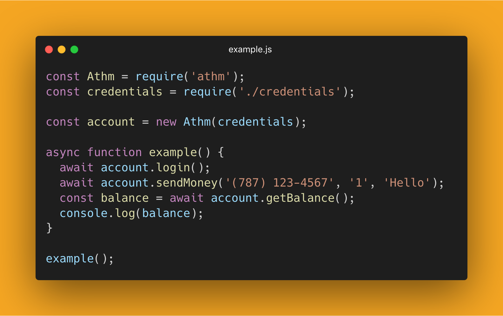

<h1 align="center">
    ATHM
</h1>
<h5 align="center"> 
    A simple library to interact with 'ATH Móvil' from Javascript.
</h5>

<!-- Single image example -->
<p align="center">
  
</p>

## 📦 Installation
```bash
npm install athm
```

## ❓ What is This?

This a library that allows you to interact with *ATH Móvil* from Javascript. You can send and receive money, view current balance, past transactions, available cards, and account holder information. Just install the NPM package, import it in your code, and start interacting with *ATH Móvil* programatically!

## 📖 Table of Contents
- [Examples](#-examples)
- [How to Set Up Credentials](#-how-to-set-up-credentials)
- [API Reference](#-api-reference)

## 📓 Examples

### Getting Balance
Self contained example to get the balance of the current account.

```js
const { Athm } = require('athm');

const credentials = {
    username: 'example@gmail.com',
    password: 'myPassword123',
    answers: { 'Q1.8': 'Albert', 'Q1.7': 'Saphire', 'Q1.10': 'San Juan' }
}

let account = new Athm(credentials);

async function printBalance() {
    await account.login();
    let balance = await account.getBalance();
    console.log(balance);
}

printBalance();
```

### Sending Money
Self contained example to send one dollar to an specified phone number using the default debit card.

```js
const { Athm } = require('athm');

const credentials = {
    username: 'example@gmail.com',
    password: 'myPassword123',
    answers: { 'Q1.8': 'Albert', 'Q1.7': 'Saphire', 'Q1.10': 'San Juan' }
}

let account = new Athm(credentials);

async function sendOneDollar() {
    await account.login();
    let send = await account.sendMoney('(787) 123-4567', '1', 'Hello.');
    console.log(send);
}

sendOneDollar();
```

### Getting Account Holder and Default Card
Self contained example to get the name of the owner of the current account and the default card associated with it.

```js
const { Athm } = require('athm');

const credentials = {
    username: 'example@gmail.com',
    password: 'myPassword123',
    answers: { 'Q1.8': 'Albert', 'Q1.7': 'Saphire', 'Q1.10': 'San Juan' }
}

let account = new Athm(credentials);

async function printInfo() {
    await account.login();
    let myName = await account.getMyName();
    let defaultCard = await account.getDefaultCard();
    console.log(myName);
    console.log(defaultCard);
}

printInfo();
```


### Getting Basic Info
Self contained example to get the name, balance and first card associated with the current account. This method, in contrast to using the other methods separately, obtains the information with a single `GET` request.

```js
const { Athm } = require('athm');

const credentials = {
    username: 'example@gmail.com',
    password: 'myPassword123',
    answers: { 'Q1.8': 'Albert', 'Q1.7': 'Saphire', 'Q1.10': 'San Juan' }
}

let account = new Athm(credentials);

async function printInfo() {
    await account.login();
    let info = await account.getBasicInfo();
    console.log(info);
    console.log(info.name);
}

printInfo();
```


### Getting Balance Using Arrow Function
Self contained example to get the balance of the current account. This examples uses an anonymous arrow function.

```js

const { Athm } = require('athm');

const credentials = {
    username: 'example@gmail.com',
    password: 'myPassword123',
    answers: { 'Q1.8': 'Albert', 'Q1.7': 'Saphire', 'Q1.10': 'San Juan' }
}

let account = new Athm(credentials);

(async () => {
    await account.login();
    let balance = await account.getBalance();
    console.log(balance);
})();
```

### Full Example
Example on how to use most of the available methods.

```js

const { Athm } = require('athm');

const credentials = {
    username: 'example@gmail.com',
    password: 'myPassword123',
    answers: { 'Q1.8': 'Albert', 'Q1.7': 'Saphire', 'Q1.10': 'San Juan' }
}

let account = new Athm(credentials);
async function fullExample() {
    let login = await account.login();
    log('Login', login)

    let info = await account.getBasicInfo();
    log('Basic Information', info);

    let cardName = await account.getFirstCardName();
    log('Card Name', cardName);

    let phone = await account.getMyPhone();
    log('Phone Number', phone);

    let email = await account.getMyEmail();
    log('Email', email);

    let receivedTransactions = await account.getReceivedTransactions();
    log('Received Transactions', receivedTransactions);

    let sentTransactions = await account.getSentTransactions();
    log('Sent Transactions', sentTransactions);

    let name = await account.getMyName();
    log('Name', name);

    let balance = await account.getBalance();
    log('Balance', balance);

    let defaultCard = await account.getDefaultCard();
    log('Default Card', defaultCard);

    // let send = await account.sendMoney('(787) 123-4567', '1', 'Hello.');
    // log('Sending Money', send);

    let logout = await account.logout();
    log('Logout', logout);

}

// Utility function to log the information in a 'pretty' way
function log(name, object) {
    let separator = '----------------------'
    console.log(name + ':');
    console.log(separator);
    console.log(object)
    console.log(separator);
    console.log('\n\n\n')
}

fullExample();
```


## 🔐 How to Set Up Credentials
1. Go to the *ATH Móvil* [configuration page](https://www.athmovil.com/web/config.htm
) and click on 'Change Security Questions'.

2. On the 'Change Security Questions' page select the questions that you want and answer them.

3. Use [this list](CredentialsHowTo.md) to determine the IDs of your selected questions.

5. Use these IDs to set up your credentials object like this:

```js
const credentials = {
    username: 'example@gmail.com',
    password: 'myPassword123',
    answers: { 'Q1.8': 'Albert', 'Q1.7': 'Saphire', 'Q1.10': 'San Juan' }
}
```

## 📚 API Reference

### Basic Methods 

#### .login()
Logs into the account. Returns `true` if successful.

#### .logout()
Logs out of the current account. Returns `true` if successful.

### Methods prefixed with 'get'
All the methods prefixed with 'get' are used to fetch a page from *ATH Móvil*, scrape it and then return the desired content. All of these methods are asynchronous. 

#### .getMyName()
Returns a `string` with the name of the account owner.

#### .getBalance()
Returns a `number` with the current account balance (for now only only for the first/default card)

#### .getMyPhone()
Returns a `string` with the phone number associated with the current account.

#### .getMyEmail()
Returns a `string` with the email associated with the current account.

#### .getBasicInfo()
Returns an `object` with the name, balance and first card associated with the current account. The advantage of this method is that it gets all of this information with a single `GET` request. The structure of the returned object is as follows: `{ name, balance, firstCard }`.

#### .getReceivedTransactions()
Returns an `object` with all the received transactions. The individual transactions are returned as objects with the following structure: `{ date, phone, amount }`.

#### .getSentTransactions()
Returns an `object` with all the sent transactions. The individual transactions are returned as objects with the following structure: `{ date, phone, amount }`.

#### .getFirstCardName()
Returns a `string` with the name of the first card.

#### .getDefaultCard()
Return an `object` with the name, hash and balance of the main card. The object structure is as follows: `{ name, hash, balance }`.

#### .getCards() - Work in progress
Returns an `object` with all the available cards in the account and their respective hashes. The individual cards are returned as objects with the following structure: `{ cardName, cardHash }`.


### Method for sending money

#### .sendMoney(phone, amount, message, cardHash)
Returns `true` if successful and `false` if something went wrong.
<!-- Returns an `object` with the transactions details if successful. Returns `false` if something went wrong. -->

*Required parameters:*

- **phone:** The number of the person to whom you want to send the money.

- **amount:** The amount of money that you want to send.

*Optional parameters:*

- **message:** The message that will be attached to the transaction. By default it is an empty string.

- **cardHash:** This parameter is used to specify the card from which the transaction will be initiated. By default `cardHash` is the same as the hash from the main card.

### Utilitiy Methods

**.fetchPage(route)**

Will make a `GET` request to the given route/resource and return the response. The complete path will be: `https://www.athmovil.com/web/ + route`

**.fetchMainPage()**

Will make a `GET` request to `https://www.athmovil.com/web/mainMenu.htm` and return the response.


**.postData(data, endpoint)**

Will make a `POST` request with the given `data` to the specified `endpoint` and return the response. The complete path will be: `https://www.athmovil.com/web/ + endpoint`.


<!-- ### Options
The Athm class can be given the following options:

- **keepAlive:** A `boolean` specifying if the instance should make perdiodic requests in order to maintain the the session alive. It is `false` by default.

- **autoLogin:** A `boolean` specifying if the instance should log in when instantiated. It is `false` by default.

```js
const config = {
  keepAlive: true,
  autoLogin: true,
}

const account = new Athm(credentials, config);
```

<br> -->

## 🚧 Work in Progress
- More features
- Documentation
- Proper test suite
- Major refactoring
- Better error handling
- Support for multiple cards

## ✨ Stay Tuned
Another interesting project is comming soon!

## 📃 License
Copyright (c) 2019 Arnaldo Gabriel

This project is licensed under the [MIT License](LICENSE).